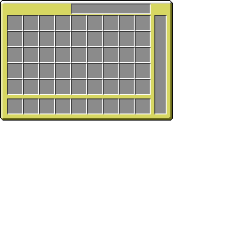
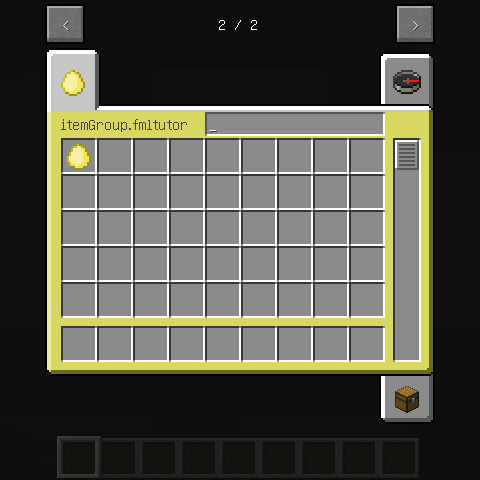

## 将你的物品和方块放入创造模式物品栏

其实这很简单，只要在物品和方块初始化的时候加上一句就好了：

**`src/main/java/com/github/ustc_zzzz/fmltutor/block/BlockGrassBlock.java:`**

```java
package com.github.ustc_zzzz.fmltutor.block;

import net.minecraft.block.Block;
import net.minecraft.block.material.Material;
import net.minecraft.creativetab.CreativeTabs;

public class BlockGrassBlock extends Block
{
    public BlockGrassBlock()
    {
        super(Material.ground);
        this.setUnlocalizedName("grassBlock");
        this.setHardness(0.5F);
        this.setStepSound(soundTypeGrass);
        this.setCreativeTab(CreativeTabs.tabBlock);
    }
}
```

构造函数的最后一句：

**`src/main/java/com/github/ustc_zzzz/fmltutor/block/BlockGrassBlock.java（部分）:`**

```java
        this.setCreativeTab(CreativeTabs.tabBlock);
```

把这个方块放到了名为“方块”的创造模式物品栏里。

## 新建一个创造模式物品栏

Minecraft的所有物品栏都是`CreativeTabs`类的子类，我们首先新建包`com.github.ustc_zzzz.fmltutor.creativetab`，并在其下新建类`CreativeTabsFMLTutor`，使其继承`CreativeTabs`类：

**`src/main/java/com/github/ustc_zzzz/fmltutor/creativetab/CreativeTabsFMLTutor.java:`**

```java
package com.github.ustc_zzzz.fmltutor.creativetab;

import com.github.ustc_zzzz.fmltutor.item.ItemLoader;

import net.minecraft.creativetab.CreativeTabs;
import net.minecraft.item.Item;

public class CreativeTabsFMLTutor extends CreativeTabs
{
    public CreativeTabsFMLTutor()
    {
        super("fmltutor");
    }

    @Override
    public Item getTabIconItem()
    {
        return ItemLoader.goldenEgg;
    }
}
```

`getTabIconItem`方法，返回的是创造模式物品栏上显示的物品。

新建包`com.github.ustc_zzzz.fmltutor.creativetab`并在其下新建类`CreativeTabsLoader`：

**`src/main/java/com/github/ustc_zzzz/fmltutor/creativetab/CreativeTabsLoader.java:`**

```java
package com.github.ustc_zzzz.fmltutor.creativetab;

import net.minecraft.creativetab.CreativeTabs;
import net.minecraftforge.fml.common.event.FMLPreInitializationEvent;

public class CreativeTabsLoader
{
    public static CreativeTabs tabFMLTutor;

    public CreativeTabsLoader(FMLPreInitializationEvent event)
    {
        tabFMLTutor = new CreativeTabsFMLTutor();
    }
}
```

并将物品注册进去：

**`src/main/java/com/github/ustc_zzzz/fmltutor/item/ItemGoldenEgg.java:`**

```java
package com.github.ustc_zzzz.fmltutor.item;

import com.github.ustc_zzzz.fmltutor.creativetab.CreativeTabsLoader;

import net.minecraft.item.Item;

public class ItemGoldenEgg extends Item
{
    public ItemGoldenEgg()
    {
        super();
        this.setUnlocalizedName("goldenEgg");
        this.setCreativeTab(CreativeTabsLoader.tabFMLTutor);
    }
}
```

最后在`CommonProxy`中的`preInit`阶段添加代码，记得创造模式物品栏的初始化一定要在物品和方块的初始化之前：

**`src/main/java/com/github/ustc_zzzz/fmltutor/common/CommonProxy.java（部分）:`**

```java
    public void preInit(FMLPreInitializationEvent event)
    {
        new CreativeTabsLoader(event);
        new ItemLoader(event);
        new BlockLoader(event);
    }
```

打开游戏，你是不是看到了物品被注册到了新的创造模式物品栏，方块被注册到了“方块”创造模式物品栏呢～

## 个性化创造模式物品栏

`CreativeTab`类提供了`hasSearchBar`方法，可以用于设置是否有搜索框，这里我们通过覆写这个方法设置为`true`：

**`src/main/java/com/github/ustc_zzzz/fmltutor/creativetab/CreativeTabsFMLTutor.java（部分）:`**

```java
    @Override
    public boolean hasSearchBar()
    {
        return true;
    }
```

我们就可以在打开的创造模式物品栏上看到搜索框了。同时还有的是一个名为`getSearchbarWidth`的方法，用于设置搜索框的宽度。

现在我们再进一步，设置一下创造模式物品栏的背景。这里我们需要的是一个名为`setBackgroundImageName`的方法，这个方法传入的参数最终会和一个非常长的路径接合，这里我们先设置一下：

```java
    public CreativeTabsFMLTutor()
    {
        super("fmltutor");
        this.setBackgroundImageName("fmltutor.png");
    }
```

然后我们需要新建文件夹`assets/minecraft/textures/gui/container/creative_inventory`（**注意这里的名称是`minecraft`不是Mod id**），然后建立一个以`tab_`开头的PNG文件，名字由刚刚设置的字符串决定，这里就是`tab_fmltutor.png`，注意，这里的图片尺寸大小需要是256x256，其他的尺寸大小会出问题，需要设置的背景放置在左上角，其他的位置设置成透明就可以了：

**`src/main/resources/assets/minecraft/textures/gui/container/creative_inventory/tab_fmltutor.png`**



现在我们就可以看到由于作者的艺术细胞极度缺乏而导致的金光闪闪熠熠生辉的创造模式物品栏了：


