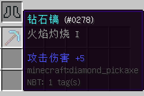

## 概述

作者在玩MC这款游戏时一直在想：要是挖铁矿出铁，挖金矿出金，那将是一件多么美妙的事。本部分将带领大家，一步一步地制作一个被用于工具的新的附魔：火焰灼烧。

## Enchantment类

和附魔相关的类就是`Enchantment`类，打开`Enchantment`类，我们可以看到多个已经预设过的附魔种类。

我们先看看`Enchantment`类的构造方法：

    protected Enchantment(int enchID, ResourceLocation enchName, int enchWeight, EnumEnchantmentType enchType)

我们解释一下这个构造方法的四个参数：

* `enchID`指的就是这个附魔的ID，我们看到原版已经定义了很多ID，当新建的ID重复时，游戏会报错。
* `enchName`指的就是这个附魔的名称，使用`ResourceLocation`的方式标记，比如时运就是`"minecraft:fortune"`，精准采集就是`"minecraft:silk_touch"`，这个名称和方块、物品的ID是类似的。
* `enchWeight`指的就是这个附魔的权重，和修复附魔需要的经验等级成负相关，和通过附魔台得到该种附魔的概率成正相关。
* `enchType`表示这种附魔是什么类型的，有武器、工具、弓等多种。

我们注意到，`enchID`如果重复，游戏会报错，所以我们将这个ID写进配置，使得玩家可以修改它，以免和原版或者某些Mod重复。

**`src/main/java/com/github/ustc_zzzz/fmltutor/common/ConfigLoader.java（部分）:`**

        public static int diamondBurnTime;
    
        public static int enchantmentFireBurn;
    
        public ConfigLoader(FMLPreInitializationEvent event)
        {
            logger = event.getModLog();
            config = new Configuration(event.getSuggestedConfigurationFile());
    
            config.load();
            load();
        }
    
        public static void load()
        {
            logger.info("Started loading config. ");
            String comment;
            
            comment = "How many seconds can a diamond burn in a furnace. ";
            diamondBurnTime = config.get(Configuration.CATEGORY_GENERAL, "diamondBurnTime", 640, comment).getInt();
    
            comment = "Fire burn enchantment id. ";
            enchantmentFireBurn = config.get(Configuration.CATEGORY_GENERAL, "enchantmentFireBurn", 36, comment).getInt();
    
            config.save();
            logger.info("Finished loading config. ");
        }

然后我们新建包`com.github.ustc_zzzz.fmltutor.enchantment`，并在其中新建一个文件`EnchantmentFireBurn.java`：

**`src/main/java/com/github/ustc_zzzz/fmltutor/enchantment/EnchantmentFireBurn.java`**

    package com.github.ustc_zzzz.fmltutor.enchantment;
    
    import com.github.ustc_zzzz.fmltutor.FMLTutor;
    import com.github.ustc_zzzz.fmltutor.common.ConfigLoader;
    
    import net.minecraft.enchantment.Enchantment;
    import net.minecraft.enchantment.EnumEnchantmentType;
    import net.minecraft.init.Items;
    import net.minecraft.item.ItemStack;
    import net.minecraft.util.ResourceLocation;
    
    public class EnchantmentFireBurn extends Enchantment
    {
        public EnchantmentFireBurn()
        {
            super(ConfigLoader.enchantmentFireBurn, new ResourceLocation(FMLTutor.MODID + ":" + "fire_burn"), 1,
                    EnumEnchantmentType.DIGGER);
            this.setName("fireBurn");
        }
    
        @Override
        public int getMinEnchantability(int enchantmentLevel)
        {
            return 15;
        }
    
        @Override
        public int getMaxEnchantability(int enchantmentLevel)
        {
            return super.getMinEnchantability(enchantmentLevel) + 50;
        }
    
        @Override
        public int getMaxLevel()
        {
            return 1;
        }
    
        @Override
        public boolean canApplyTogether(Enchantment ench)
        {
            return super.canApplyTogether(ench) && ench.effectId != silkTouch.effectId && ench.effectId != fortune.effectId;
        }
    
        @Override
        public boolean canApply(ItemStack stack)
        {
            return stack.getItem() == Items.shears ? true : super.canApply(stack);
        }
    }

`setName`方法的作用和方块、物品等的`setUnlocalizedName`方法类似，我们修改一下语言文件：

**`src/main/resources/assets/fmltutor/lang/en_US.lang（部分）:`**

    enchantment.fireBurn=Fire Burning

**`src/main/resources/assets/fmltutor/lang/zh_CN.lang（部分）:`**

    enchantment.fireBurn=火焰灼烧

`getMinEnchantability`和`getMaxEnchantability`方法的作用就是获取可以获取到此附魔的最低等级和最高等级。这里被设置成了和精准采集相同。

`getMaxLevel`方法指的就是这个附魔的最大等级了。自然，这个附魔只应该有一个等级。

`canApplyTogether`方法表示的是这个附魔可否与其他附魔共存。这里设定为不能和精准采集和时运共存。

`canApply`方法表示的是这个附魔可以作用的物品。既然是一个作用于工具的附魔，自然作用对象是所有工具和剪刀。

然后我们在`com.github.ustc_zzzz.fmltutor.enchantment`包下新建`EnchantmentLoader.java`文件，完成对这个附魔属性的注册：

**`src/main/java/com/github/ustc_zzzz/fmltutor/enchantment/EnchantmentLoader.java`**

    package com.github.ustc_zzzz.fmltutor.enchantment;
    
    import com.github.ustc_zzzz.fmltutor.common.ConfigLoader;
    
    import net.minecraft.enchantment.Enchantment;
    
    public class EnchantmentLoader
    {
        public static Enchantment fireBurn;
    
        public EnchantmentLoader()
        {
            try
            {
                fireBurn = new EnchantmentFireBurn();
                Enchantment.addToBookList(fireBurn);
            }
            catch (Exception e)
            {
                ConfigLoader.logger().error(
                        "Duplicate or illegal enchantment id: {}, the registry of class '{}' will be skipped. ",
                        ConfigLoader.enchantmentFireBurn, EnchantmentFireBurn.class.getName());
            }
        }
    }

这里对该种附魔进行注册，如果ID重复，则输出错误信息。

`addToBookList`方法使得该附魔被注册，使其在附魔台上可以被注册到，在创造模式物品栏上也可以找到对应的附魔书。

下面是一张拥有此种附魔的钻石镐示例：

## 完善你的附魔

为了使我们的附魔可以产生作用，我们需要在特定的地方监听事件，以使这个附魔产生作用：

**`src/main/java/com/github/ustc_zzzz/fmltutor/common/EventLoader.java（部分）:`**

        @SubscribeEvent
        public void onBlockHarvestDrops(BlockEvent.HarvestDropsEvent event)
        {
            if (!event.world.isRemote && event.harvester != null)
            {
                ItemStack itemStack = event.harvester.getHeldItem();
                if (EnchantmentHelper.getEnchantmentLevel(EnchantmentLoader.fireBurn.effectId, itemStack) > 0
                        && itemStack.getItem() != Items.shears)
                {
                    for (ItemStack stack : event.drops)
                    {
                        ItemStack newStack = FurnaceRecipes.instance().getSmeltingResult(stack);
                        if (newStack != null)
                        {
                            newStack = newStack.copy();
                            newStack.stackSize = stack.stackSize;
                            event.drops.set(event.drops.indexOf(stack), newStack);
                        }
                        else if (stack != null)
                        {
                            Block block = Block.getBlockFromItem(stack.getItem());
                            boolean b = (block == null);
                            if (!b && (block.isFlammable(event.world, event.pos, EnumFacing.DOWN)
                                    || block.isFlammable(event.world, event.pos, EnumFacing.EAST)
                                    || block.isFlammable(event.world, event.pos, EnumFacing.NORTH)
                                    || block.isFlammable(event.world, event.pos, EnumFacing.SOUTH)
                                    || block.isFlammable(event.world, event.pos, EnumFacing.UP)
                                    || block.isFlammable(event.world, event.pos, EnumFacing.WEST)))
                            {
                                event.drops.remove(stack);
                            }
                        }
                    }
                }
            }
        }

我们监听了方块被挖掘后即将掉落物品的事件，在玩家手持存在“火焰灼烧”附魔的工具时，将其换成被灼烧过的物品掉落。

最后在`CommonProxy`中注册：

**`src/main/java/com/github/ustc_zzzz/fmltutor/common/CommonProxy.java（部分）:`**

        public void init(FMLInitializationEvent event)
        {
            new CraftingLoader();
            new EnchantmentLoader();
            new EventLoader();
        }

打开游戏试试吧～
