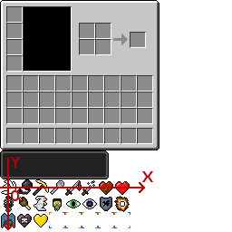
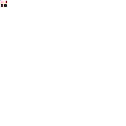

## 概述

很多MOD都添加了玩家的附属效果，使用药水效果的方式展示玩家的效果有着清晰直观、方便控制的特点，本部分将以一个拥有摔落保护的药水效果为例，一步一步地带领大家实现一个崭新的药水效果。

## 一个崭新的药水效果

新建包`com.github.ustc_zzzz.fmltutor.potion`，在其中新建一个文件`PotionLoader.java`：

**`src/main/java/com/github/ustc_zzzz/fmltutor/potion/PotionLoader.java:`**

    package com.github.ustc_zzzz.fmltutor.potion;
    
    import net.minecraft.potion.Potion;
    import net.minecraftforge.fml.common.event.FMLPreInitializationEvent;
    
    public class PotionLoader
    {
        public static Potion potionFallProtection;
    
        public PotionLoader(FMLPreInitializationEvent event)
        {
            potionFallProtection = new PotionFallProtection();
        }
    }

在包`com.github.ustc_zzzz.fmltutor.potion`下新建文件`PotionFallProtection.java`：

**`src/main/java/com/github/ustc_zzzz/fmltutor/potion/PotionFallProtection.java:`**

    package com.github.ustc_zzzz.fmltutor.potion;
    
    import com.github.ustc_zzzz.fmltutor.FMLTutor;
    
    import net.minecraft.potion.Potion;
    import net.minecraft.util.ResourceLocation;
    
    public class PotionFallProtection extends Potion
    {
        private static final ResourceLocation res = new ResourceLocation(FMLTutor.MODID + ":" + "textures/gui/potion.png");
    
        public PotionFallProtection()
        {
            super(new ResourceLocation(FMLTutor.MODID + ":" + "fall_protection"), false, 0x7F0000);
            this.setPotionName("potion.fallProtection");
            this.setIconIndex(0, 0);
        }
    }

我们讲一下`Potion`构造方法的三个参数：

* 第一个参数表示这个药水效果的名称，其使用方式和附魔相同
* 第二个参数表示这个附魔是否有害，这里很明显是无害的
* 第三个参数表示这个附魔的粒子效果（螺旋）颜色，这里定为深红色

`setIconIndex`方法表示这个药水效果在显示的时候使用的图标在下面这张图（来自`assets.minecraft.textures.gui.container.inventory.png`）中的位置，两个参数表示x和y坐标，这里设置为和速度药水效果的图标一致：

`setPotionName`方法和附魔的`setName`方法，以及方块、物品等的`setUnlocalizedName`方法类似，我们修改一下语言文件：

**`src/main/resources/assets/fmltutor/lang/en_US.lang（部分）:`**

    potion.fallProtection=Fall Protection

**`src/main/resources/assets/fmltutor/lang/zh_CN.lang（部分）:`**

    potion.fallProtection=摔落保护

在`preInit`阶段初始化：

**`src/main/java/com/github/ustc_zzzz/fmltutor/common/CommonProxy.java（部分）:`**

        public void preInit(FMLPreInitializationEvent event)
        {
            new ConfigLoader(event);
            new CreativeTabsLoader(event);
            new ItemLoader(event);
            new BlockLoader(event);
            new PotionLoader(event);
        }

打开游戏，输入：

    /effect @a fmltutor:fall_protection

按下E键，就可以看到药水效果啦～

## 使药水效果起到作用

我们在适当的时机通过调用`EntityLiving`类的`getActivePotionEffect`方法来使得药水效果真正起到作用，这里我们监视事件`LivingHurtEvent`：

**`src/main/java/com/github/ustc_zzzz/fmltutor/common/EventLoader.java（部分）:`**

        @SubscribeEvent
        public void onLivingHurt(LivingHurtEvent event)
        {
            if (event.source.getDamageType().equals("fall"))
            {
                PotionEffect effect = event.entityLiving.getActivePotionEffect(PotionLoader.potionFallProtection);
                if (effect != null)
                {
                    if (effect.getAmplifier() == 0)
                    {
                        event.ammount /= 2;
                    }
                    else
                    {
                        event.ammount = 0;
                    }
                }
            }
        }

这段代码的作用就是当该药水效果等级为一时，摔落效果带来的伤害减半，如果等级超过一，伤害置零。

`PotionEffect`类和`Potion`类的区别就是`PotionEffect`是一个特殊化了的药水效果，该药水效果被赋予了时长和等级等。

## 让药水效果拥有自己的图标

刚刚我们可能注意到了，虽然我们可以指定药水效果的图标，但是这些图标都只被局限在一个图片中，所幸的是，Forge给我们提供了一个方法，让我们可以自定义药水的图标：

**`src/main/java/com/github/ustc_zzzz/fmltutor/potion/PotionFallProtection.java:`**

    package com.github.ustc_zzzz.fmltutor.potion;
    
    import com.github.ustc_zzzz.fmltutor.FMLTutor;
    
    import net.minecraft.client.Minecraft;
    import net.minecraft.potion.Potion;
    import net.minecraft.potion.PotionEffect;
    import net.minecraft.util.ResourceLocation;
    
    public class PotionFallProtection extends Potion
    {
        private static final ResourceLocation res = new ResourceLocation(FMLTutor.MODID + ":" + "textures/gui/potion.png");
    
        public PotionFallProtection()
        {
            super(new ResourceLocation(FMLTutor.MODID + ":" + "fall_protection"), false, 0x7F0000);
            this.setPotionName("potion.fallProtection");
            // this.setIconIndex(0, 0);
        }
    
        @Override
        public void renderInventoryEffect(int x, int y, PotionEffect effect, Minecraft mc)
        {
            mc.getTextureManager().bindTexture(PotionFallProtection.res);
            mc.currentScreen.drawTexturedModalRect(x + 6, y + 7, 0, 0, 18, 18);
        }
    }

我们这里覆写的就是`renderInventoryEffect`方法，这个方法是当该药水效果的图标绘制时调用的。

除此之外，我们还要提供一个大小为256x256（其它尺寸是不可行的，只能256x256）的图片，并在左上角放上对应的18x18图标（这里终于是原创的了^_^）。

**`src/main/resources/assets/fmltutor/textures/gui/potion.png:`**

（轻点打我。。。这个想法是一个叫作Blair的同学提供的，也为了纪念本部分的章节号23333333） （我相信知道Blair是谁的人一定不会阅读到这部分教程(～￣▽￣)～）

现在，我们分析一下这个方法：

* `x`参数表示药水效果框左上角的横坐标
* `y`参数表示药水效果框左上角的纵坐标
* `effect`参数表示该药水效果对应的`PotionEffect`
* `mc`参数表示当前的这个游戏

`bindTexture`方法用于绑定我们想要用于绘制的图片，这里就是上面我们提供的图片。

`drawTexturedModalRect`方法就是用于绘制这个图标了，我们这里简要分析一下这个方法，该方法在后面的部分还会提到，并加以更加详细的解释：

* 第一个参数和第二个参数表示绘制的图标在游戏中的左上角的横纵坐标（xy值）。这里照着原版的数据做就行了
* 第三个参数和第四个参数表示绘制的图标在图片中的左上角的横纵坐标（uv值）。这里是整张图的左上角，自然都是零
* 第五个参数和第六个参数表示绘制的图标大小。这里和原版一样，是18x18

现在打开游戏，是不是看到自定义的药水效果图标了呢～

下面是效果示例图：

