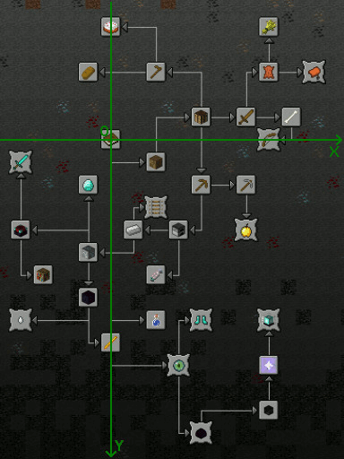
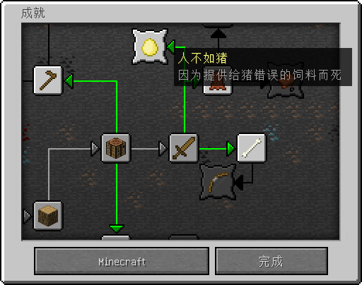

## 概述

成就系统往往在一个游戏中占有着重要的部分，通过这个成就系统，游戏可以引导玩家向游戏希望的方向发展。一个好的游戏，往往都会有着完善的、引导性强的成就系统。Minecraft这款游戏的原版成就系统虽然引导性不够强，但却是相当完善的。Forge通过成就页的方式使得每个Mod都可以产生自己的成就系统。

本部分将一步一步地带领读者完成一个新成就，和一个新成就页。

## 新的成就

本部分我们首先试图制作一个在前面部分制作的当玩家提供给猪错误的饲料产生伤害而死的成就。

我们新建一个包`com.github.ustc_zzzz.fmltutor.achievement`，并在其中新建一个文件`AchievementLoader.java`：

**`src/main/java/com/github/ustc_zzzz/fmltutor/achievement/AchievementLoader.java:`**

    package com.github.ustc_zzzz.fmltutor.achievement;
    
    import com.github.ustc_zzzz.fmltutor.item.ItemLoader;
    
    import net.minecraft.stats.Achievement;
    import net.minecraft.stats.AchievementList;
    
    public class AchievementLoader
    {
        public static Achievement worseThanPig = new Achievement("achievement.fmltutor.worseThanPig",
                "fmltutor.worseThanPig", 5, -4, ItemLoader.goldenEgg, AchievementList.buildSword);
    
        public AchievementLoader()
        {
            worseThanPig.setSpecial().registerStat();
        }
    }

Minecraft提供了一个`Achievement`类，现在我们看一个这个`Achievement`类的构造方法：

* 第一个参数是这个成就的名称。
* 第二个参数是这个成就的非本地化名称。
* 第三个参数和第四个参数是这个成就所在成就图中的位置，分别为x和y坐标。
* 第五个参数是这个成就在成就图上显示的图标。
* 最后一个参数是这个成就依赖的成就，如果这个成就独立，那么设为null。

为使得成就的非本地化名称生效，我们更改一下语言文件：

**`src/main/resources/assets/fmltutor/lang/en_US.lang（部分）:`**

    achievement.fmltutor.worseThanPig=Worse Than Pig
    achievement.fmltutor.worseThanPig.desc=Die from inappropriate food for the pig

**`src/main/resources/assets/fmltutor/lang/zh_CN.lang（部分）:`**

	achievement.fmltutor.worseThanPig=人不如猪
	achievement.fmltutor.worseThanPig.desc=因为提供给猪错误的饲料而死

含`desc`部分的行表示成就的显示描述，不含`desc`部分的行表示这个成就的显示名称。

下面这张图是一张Minecraft原版所有成就的坐标位置图，其中x和y均为零的位置，就是打开物品栏那个成就的位置：

`setSpecial`方法用于设置这个成就是一种特殊成就，在成就图上会有花边，获得成就时显示的文字也是紫色的。

然后，我们通过对这个`Achievement`类的实例调用`registerStat`方法注册这个成就。

最后我们在`CommonProxy`完成注册：

**`src/main/java/com/github/ustc_zzzz/fmltutor/common/CommonProxy.java（部分）:`**

        public void init(FMLInitializationEvent event)
        {
            new CraftingLoader();
            new EnchantmentLoader();
            new AchievementLoader();
            new EventLoader();
        }

打开游戏，就可以在成就图上看到对应的成就了：

## 新的成就页

Forge提供了一个名为`AchievementPage`的类，我们可以实例化这个类，并注册他们（这里新添加了两个成就）：

**`src/main/java/com/github/ustc_zzzz/fmltutor/achievement/AchievementLoader.java:`**

    package com.github.ustc_zzzz.fmltutor.achievement;
    
    import com.github.ustc_zzzz.fmltutor.FMLTutor;
    import com.github.ustc_zzzz.fmltutor.block.BlockLoader;
    import com.github.ustc_zzzz.fmltutor.item.ItemLoader;
    
    import net.minecraft.init.Blocks;
    import net.minecraft.stats.Achievement;
    import net.minecraft.stats.AchievementList;
    import net.minecraftforge.common.AchievementPage;
    
    public class AchievementLoader
    {
        public static Achievement worseThanPig = new Achievement("achievement.fmltutor.worseThanPig",
                "fmltutor.worseThanPig", 5, -4, ItemLoader.goldenEgg, AchievementList.buildSword);
        public static Achievement buildGrassBlock = new Achievement("achievement.fmltutor.buildGrassBlock",
                "fmltutor.buildGrassBlock", 0, 0, Blocks.vine, null);
        public static Achievement explosionFromGrassBlock = new Achievement("achievement.fmltutor.explosionFromGrassBlock",
                "fmltutor.explosionFromGrassBlock", 2, -1, BlockLoader.grassBlock, buildGrassBlock);
    
        public static AchievementPage pageFMLTutor = new AchievementPage(FMLTutor.NAME, buildGrassBlock,
                explosionFromGrassBlock);
    
        public AchievementLoader()
        {
            worseThanPig.setSpecial().registerStat();
            buildGrassBlock.initIndependentStat().registerStat();
            explosionFromGrassBlock.setSpecial().registerStat();
    
            AchievementPage.registerAchievementPage(pageFMLTutor);
        }
    }

`AchievementPage`类是Forge提供的，作用就是把不同种类的成就以不同的成就页方式隔离。

`AchievementPage`类构造方法的第一个参数，是这个成就页的名称，这里用这个Mod的名称代替，而其第二个参数开始，就是这个成就页的所有成就，没有加入任何成就页的成就默认在原版的成就页上显示。

`initIndependentStat`方法用于设置这个成就是一个独立的、不依赖于其他成就的成就。很明显，一个成就页必须至少存在这样一个成就。

`registerAchievementPage`这个静态方法，就是注册这个成就页了。

最后我们修改一下语言文件，把新添加的两个成就对应的显示文字加进去：

**`src/main/resources/assets/fmltutor/lang/en_US.lang（部分）:`**

	achievement.fmltutor.worseThanPig=Worse Than Pig
	achievement.fmltutor.worseThanPig.desc=Die from inappropriate food for the pig
	achievement.fmltutor.buildGrassBlock=Grass Block
	achievement.fmltutor.buildGrassBlock.desc=Build a grass block
	achievement.fmltutor.explosionFromGrassBlock=Grass Block Explosion
	achievement.fmltutor.explosionFromGrassBlock.desc=Make an explosion of grass block by the click

**`src/main/resources/assets/fmltutor/lang/zh_CN.lang（部分）:`**

	achievement.fmltutor.worseThanPig=人不如猪
	achievement.fmltutor.worseThanPig.desc=因为提供给猪错误的饲料而死
	achievement.fmltutor.buildGrassBlock=草块
	achievement.fmltutor.buildGrassBlock.desc=制作一个草块
	achievement.fmltutor.explosionFromGrassBlock=草块爆炸
	achievement.fmltutor.explosionFromGrassBlock.desc=通过点击草块使草块爆炸

## 使成就可以被获得

我们可以注意到，我们添加的成就，并不能通过任何自然的、符合成就本身目的的方式获得，所以我们添加并修改一些事件：

**`src/main/java/com/github/ustc_zzzz/fmltutor/common/EventLoader.java（部分）:`**

        @SubscribeEvent
        public void onPlayerClickGrassBlock(PlayerRightClickGrassBlockEvent event)
        {
            if (!event.world.isRemote)
            {
                BlockPos pos = event.pos;
                Entity tnt = new EntityTNTPrimed(event.world, pos.getX() + 0.5, pos.getY() + 0.5, pos.getZ() + 0.5, null);
                event.world.spawnEntityInWorld(tnt);
                event.entityPlayer.triggerAchievement(AchievementLoader.explosionFromGrassBlock);
            }
        }

**`src/main/java/com/github/ustc_zzzz/fmltutor/common/EventLoader.java（部分）:`**

        @SubscribeEvent
        public void onLivingDeath(LivingDeathEvent event)
        {
            if (event.entityLiving instanceof EntityPlayer && event.source.getDamageType().equals("byPig"))
            {
                ((EntityPlayer) event.entityLiving).triggerAchievement(AchievementLoader.worseThanPig);
            }
        }
    
        @SubscribeEvent
        public void onPlayerItemCrafted(PlayerEvent.ItemCraftedEvent event)
        {
            if (event.crafting.getItem() == Item.getItemFromBlock(BlockLoader.grassBlock))
            {
                event.player.triggerAchievement(AchievementLoader.buildGrassBlock);
            }
        }

我们通过调用玩家的`triggerAchievement`方法，成功地使玩家获得了我们想要获得的成就。
