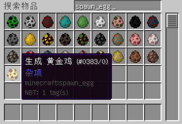

## 写在前面

我们终于跨过了基础部分和初级部分，来到了高级部分。读者会在这里遇到一些小的Mod往往不会出现，但是如果想要做一些特殊的，与Minecraft贴合较近的高级特性。如果读者跳过了前面的部分章节，请保证你至少阅读了绪论、基础部分、和初级部分的第一节，也就是事件。

到了这一部分，作者就不会对每一段代码都进行较详细的解释，有的可能只会是一笔带过，有的甚至不会加以讲解。这是因为到了这一部分，Minecraft的代码在不同的版本间变化将会非常巨大，导致很多东西，尤其是和Minecraft联系紧密的使用方法，可能在下一个版本就被换掉了。

所以作者希望读者在教程中级部分，已经拥有了一定程度的不借助JavaDoc的代码分析能力，这包括但不限于，查看一个类是已经被什么样的类继承的，查看一个类中被覆写的方法对应父类的方法是什么样子的，等等。如果读者觉得这方面还不够清楚，这里作者建议，先从熟悉自己的IDE开始。

如果在熟悉自己的IDE方面不知从何下手，这里作者给出一个提示：在一些常见的IDE中，当开发者按下键盘上的Ctrl键的时候，代码部分将会变得大不一样，一些代码甚至可以进行点击。如果已经对IDE的熟悉程度，和不借助JavaDoc的代码分析能力，有了一定自信的话，那么，就来体验Minecraft的设计思想所带来的灵活性，和这种灵活性在Forge的辅助下所带来的可扩展性吧！

## 实体概述

在Minecraft世界中，实体占据着非常重要的一部分。可以说，组成Minecraft世界的，除了物品和方块，基本就是实体了。不管是可怕的凋灵还是凋灵抛出去的火球，抑或是玩家还是玩家扔出去的末影之眼，小到掉落的经验球，大到飞翔的末影龙，快到在铁轨上飞奔的矿车，慢到在水中静止的钓鱼钩，在地上站立的盔甲架，在墙上悬挂的一幅画，在天上咆哮的闪电，在空中绚丽的烟花，和善如猪牛羊，恐怖如末影人，生物的掉落物品，末地的末影水晶，等等，全部都是实体完成的。

实体的核心是一个名为`Entity`的类，一般一个实体都有着下面几个属性：

* 运动属性，包括一个维度坐标，三个位置坐标，和两个姿态坐标，没错，相较刚体而言少了一个姿态坐标
* 大小，也就是碰撞箱，每个实体都被看做有着固定长宽和固定高度的一个立方体，在旋转的时候这个立方体是不变的
* 状态，包括实体是不是骑着另一个实体，是否着火，是否在水中等
* 一个唯一标识ID，即UUID

生物作为一种特殊的实体，核心是一个名为`EntityLiving`的类，除了刚刚所述的特性之外，生物一般还有着下面这些特性：

* 既定属性，如经验值、跟踪半径、手持物品、存活时间等
* 既定行为，如观察、行走、跳跃、攻击、寻路等
* 人工智能，也就是AI，对既定行为的一定程度的自动化实施能力

因为在Mod中创建或者改造生物要比一般的实体常见，所以说这里我们重点讲生物的相关属性，当然，其中的部分，是可以应用到实体上的。

我们来看看生物对应的类，也就是`EntityLiving`类的继承树：

    \-EntityLiving
      \-EntityAmbientCreature
        |-EntityBat
      \-EntityCreature
        \-EntityAgeable
          \-EntityAnimal
            |-EntityChicken
            \-EntityCow
              |-EntityMooshroom
            |-EntityHorse
            |-EntityPig
            |-EntityRabbit
            |-EntitySheep
            \-EntityTameable
              |-EntityOcelot
              |-EntityWolf
          |-EntityVillager
        \-EntityGolem
          |-EntityIronGolem
          |-EntitySnowman
        \-EntityMob
          |-EntityBlaze
          |-EntityCreeper
          |-EntityEnderman
          |-EntityEndermite
          |-EntityGiantZombie
          |-EntityGuardian
          |-EntitySilverfish
          |-EntitySkeleton
          \-EntitySpider
            |-EntityCaveSpider
          |-EntityWitch
          |-EntityWither
          \-EntityZombie
            |-EntityPigZombie
      |-EntityDragon
      \-EntityFlying
        |-EntityGhast
      \-EntitySlime
        |-EntityMagmaCube
      \-EntityWaterMob
        |-EntitySquid

还有几个常用的接口：

* `IAnimals`表示动物，几乎所有生物对应的类都继承了这个接口
* `IMob`表示怪物，注意怪物也是动物的一种
* `INpc`表示像村民一样的NPC，背后一定有着一些不为人知的交易
* `IRangedAttackMob`表示可以产生一定范围内的攻击的怪物，比如部分可以发射弹射物的怪物
* `IBossDisplayData`表示这个怪物是一个可以显示血条的Boss
* `IEntityOwnable`表示这个生物可以被驯服，比如豹猫和狼

## 新的实体生物

就像刚刚我们看到的一样，如果注册一个新的实体生物的话，我们就需要首先建立一个`EntityLiving`的子类。读者可以根据自己的需要和代码的利用，选择适合的类进行继承，并添加上适当的接口。

新建包`com.github.ustc_zzzz.fmltutor.entity`，并在其下新建一个文件`EntityGoldenChicken.java`：

**`src/main/java/com/github/ustc_zzzz/fmltutor/entity/EntityGoldenChicken.java:`**

    package com.github.ustc_zzzz.fmltutor.entity;
    
    import net.minecraft.entity.passive.EntityChicken;
    import net.minecraft.world.World;
    
    public class EntityGoldenChicken extends EntityChicken
    {
        public EntityGoldenChicken(World worldIn)
        {
            super(worldIn);
        }
    
        @Override
        public void onLivingUpdate()
        {
            super.onLivingUpdate();
        }
    }

这里我们想要做的是一个金色的鸡，所以我们这里继承了`EntityChicken`类。

首先，一个实体需要有一个传入世界参数的构造函数，**如果希望这个实体生物可以在世界自然生成，这一个传入世界参数的构造函数是必要的**。这里简单继承父类的就可以了。

然后，我们就来到了一个相对实体生物来说比较重要的一个方法，也就是名为`onLivingUpdate`的方法。这个方法用于对实体生物的更新，包括更新实体的AI等。若干gametick更新一次，也就是这个方法被调用一次，在本部分的稍后作者会讲到如何设置这个更新频率。这里我们先显式覆写这个方法，将来我们也会向其中添加我们想要的内容。

在`onLivingUpdate`方法中额外添加的内容，大多是一些不属于人工智能的行为，比如骷髅在阳光下着火，动物会相互发送爱心（不包括繁殖）等。那些AI的添加，我们会在后面的部分中进行讲解。

## 掉落物

我们添加下面的代码：

**`src/main/java/com/github/ustc_zzzz/fmltutor/entity/EntityGoldenChicken.java（部分）:`**

        @Override
        protected void dropFewItems(boolean arg1, int arg2)
        {
            if (this.rand.nextInt(10) == 0)
            {
                this.dropItem(ItemLoader.goldenEgg, 1);
            }
            super.dropFewItems(arg1, arg2);
        }

在Minecraft中，通过调用实体生物的`dropFewItems`方法来使得实体生物掉落物品，一般会在实体生物死亡时调用。该方法的第一个参数用于给出该实体生物是被玩家攻击致死，还是由于自然原因等而死，比如蜘蛛眼的获取，就必须保证对应的蜘蛛是玩家攻击致死的。该方法的第二个参数，指的是抢夺等级，也就是玩家攻击生物致死时的使用的武器的抢夺等级。这里我们覆写了这个方法，以10%的概率添加一种新的掉落。

如果没有多于一个的掉落，或者数量异常的掉落，可以覆写对应类的`getDropItem`方法，通过覆写这个方法，我们就可以使用一种比较平凡的方式掉落我们想要的物品。

## 注册这个实体生物

在包`com.github.ustc_zzzz.fmltutor.entity`下新建一个文件`EntityLoader.java`：

**`src/main/java/com/github/ustc_zzzz/fmltutor/entity/EntityLoader.java:`**

    package com.github.ustc_zzzz.fmltutor.entity;
    
    import com.github.ustc_zzzz.fmltutor.FMLTutor;
    
    import net.minecraft.entity.Entity;
    import net.minecraftforge.fml.common.registry.EntityRegistry;
    
    public class EntityLoader
    {
        private static int nextID = 0;
    
        public EntityLoader()
        {
            registerEntity(EntityGoldenChicken.class, "GoldenChicken", 80, 3, true);
        }
    
        private static void registerEntity(Class<? extends Entity> entityClass, String name, int trackingRange,
                int updateFrequency, boolean sendsVelocityUpdates)
        {
            EntityRegistry.registerModEntity(entityClass, name, nextID++, FMLTutor.instance, trackingRange, updateFrequency,
                    sendsVelocityUpdates);
        }
    }

正如读者所见的那样，我们通过Forge提供的`EntityRegistry`类注册一个实体，我们先看看对应的注册实体的方法，也就是`registerModEntity`方法：

    public static void registerModEntity(Class<? extends Entity> entityClass, String entityName, int id, Object mod, int trackingRange, int updateFrequency, boolean sendsVelocityUpdates) {...}

* 第一个参数需要传入这个实体对应的class实例，这里传入`EntityGoldenChicken.class`是没有什么问题的
* 第二个参数需要传入这个实体的名称，不过这里我们和物品、方块等不一样，**实体的名称建议使用大写驼峰式**，这里传入的就是`GoldenChicken`
* 第三个参数表示这个实体类型的ID，同一个Mod的每一个实体类型的ID要不同，这里是通过递增处理的
* 第四个参数表示这个实体对应的Mod实例，这里我们使用主类中提供的Mod实例，也没有什么问题
* 第五个参数表示这个实体的跟踪半径，也就是说如果这个实体距离玩家一量超过对应的大小，这个实体就不更新了，**一般情况下，生物设置成64格是比较合理的**，当然有的实体有特殊需要，这个参数设置得比较大
* 第六个参数表示这个实体的更新频率，**对于生物来说，每3 gametick一更新是比较常见的做法**，当然有的会设置成特别长，有10 gametick，20 gametick，甚至整数的最大值，也就是不更新
* 最后一个参数表示是否同步实体的速度更新，对于一些实体，比如静止的实体，一些会手动更新数据的BOSS，是没有必要的，但是对于实体生物来说是有必要的，这里设置为真

然后在`CommonProxy`的`preInit`阶段中注册：

**`src/main/java/com/github/ustc_zzzz/fmltutor/common/CommonProxy.java（部分）:`**

        public void preInit(FMLPreInitializationEvent event)
        {
            new ConfigLoader(event);
            new CreativeTabsLoader(event);
            new FluidLoader(event);
            new ItemLoader(event);
            new BlockLoader(event);
            new OreDictionaryLoader(event);
            new PotionLoader(event);
            new EntityLoader();
        }

到目前为止，一个实体已经注册完成了。不过还有一点小的事情需要处理，那就是对应的语言文件：

**`src/main/resources/assets/fmltutor/lang/en_US.lang（部分）:`**

    entity.fmltutor.GoldenChicken.name=Golden Chicken

**`src/main/resources/assets/fmltutor/lang/zh_CN.lang（部分）:`**

    entity.fmltutor.GoldenChicken.name=黄金鸡

语言文件中出现的那个`GoldenChicken`，代表的就是实体的名字。

## 注册刷怪蛋

我们新添加下面的代码：

**`src/main/java/com/github/ustc_zzzz/fmltutor/entity/EntityLoader.java（部分）:`**

        public EntityLoader()
        {
            registerEntity(EntityGoldenChicken.class, "GoldenChicken", 80, 3, true);
            registerEntityEgg(EntityGoldenChicken.class, 0xffff66, 0x660000);
        }
    
        private static void registerEntityEgg(Class<? extends Entity> entityClass, int eggPrimary, int eggSecondary)
        {
            EntityRegistry.registerEgg(entityClass, eggPrimary, eggSecondary);
        }
        
注册刷怪蛋的方法其实很简单，调用`EntityRegistry`类的`registerEgg`方法就可以了。这个方法的第一个参数表示实体对应的class实例，后面的两个参数表示刷怪蛋的主色和副色，也就是蛋本身的颜色和对应的斑点，注册完成后打开游戏，我们就可以看到下面的游戏画面了：

拿着刷怪蛋右键方块，我们就可以产生一个新的实体了。不过这里我们没有讲解如何注册对应的实体的渲染，所以现在的实体使用的渲染还是它父类的渲染，也就是鸡的样子，在后面的部分我们会讲解如何自定义渲染。

## 使用代码生成实体

其实在前面的部分我们已经对在世界上生成实体，有了一定的运用了，我们在这里再简单提一下，为了演示，我们为这个Mod加一点小小的特性：

**`src/main/java/com/github/ustc_zzzz/fmltutor/common/EventLoader.java（部分）:`**

        @SubscribeEvent
        public void onPlayerClickGrassBlock(PlayerRightClickGrassBlockEvent event)
        {
            if (!event.world.isRemote)
            {
                ItemStack heldItem = event.entityPlayer.getHeldItem();
                if (ItemLoader.goldenEgg.equals(heldItem.getItem()))
                {
                    EntityLiving entityLiving = new EntityGoldenChicken(event.world);
                    BlockPos pos = event.pos;
                    entityLiving.setPositionAndUpdate(pos.getX() + 0.5, pos.getY() + 0.5, pos.getZ() + 0.5);
                    --heldItem.stackSize;
                    event.world.spawnEntityInWorld(entityLiving);
                    return;
                }
                BlockPos pos = event.pos;
                Entity tnt = new EntityTNTPrimed(event.world, pos.getX() + 0.5, pos.getY() + 0.5, pos.getZ() + 0.5, null);
                event.world.spawnEntityInWorld(tnt);
                event.entityPlayer.triggerAchievement(AchievementLoader.explosionFromGrassBlock);
            }
        }

当玩家达到对应的触发条件（拿着金蛋右击草块）的时候：

**`src/main/java/com/github/ustc_zzzz/fmltutor/common/EventLoader.java（部分）:`**

                    EntityLiving entityLiving = new EntityGoldenChicken(event.world);
                    BlockPos pos = event.pos;
                    entityLiving.setPositionAndUpdate(pos.getX() + 0.5, pos.getY() + 0.5, pos.getZ() + 0.5);

我们先实例化一个新的实体对应的类，然后设置一下这个实体的位置。

**`src/main/java/com/github/ustc_zzzz/fmltutor/common/EventLoader.java（部分）:`**

                    event.world.spawnEntityInWorld(entityLiving);

最后我们通过`spawnEntityInWorld`方法，生成了这个实体。
