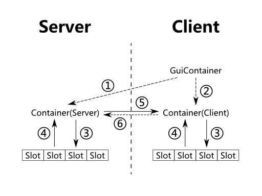
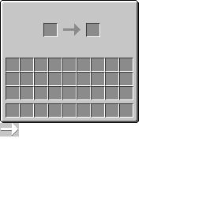

## 概述

还记得这张图吗？



本节将介绍这张图中的⑤部分。

此外，本节将在之间的章节中制作的熔炉添加一个GUI，也就是说将TileEntity中的数据应用到GUI中。

## 准备工作

我们先准备一张GUI的贴图，并将其起名为`gui_metal_furnace.png`，放入`assets.fmltutor.textures.gui.container`目录下：

**`src/main/resources/assets/fmltutor/textures/gui/container/gui_metal_furnace.png:`**



（好像没有燃料槽？不要在意这些细节）

实际上，用于熔炉的GUI的代码和之间使用的示例GUI的代码是十分相近的。我们先在包`com.github.ustc_zzzz.fmltutor.inventory`下新建类`ContainerMetalFurnace`：

**`src/main/java/com/github/ustc_zzzz/fmltutor/inventory/ContainerMetalFurnace.java:`**

```java
package com.github.ustc_zzzz.fmltutor.inventory;

import com.github.ustc_zzzz.fmltutor.tileentity.TileEntityMetalFurnace;

import net.minecraft.entity.player.EntityPlayer;
import net.minecraft.inventory.Container;
import net.minecraft.inventory.Slot;
import net.minecraft.item.ItemStack;
import net.minecraft.tileentity.TileEntity;
import net.minecraft.util.EnumFacing;
import net.minecraftforge.items.CapabilityItemHandler;
import net.minecraftforge.items.IItemHandler;
import net.minecraftforge.items.SlotItemHandler;

public class ContainerMetalFurnace extends Container
{
    private IItemHandler upItems;
    private IItemHandler downItems;

    protected TileEntityMetalFurnace tileEntity;

    protected int burnTime = 0;

    public ContainerMetalFurnace(EntityPlayer player, TileEntity tileEntity)
    {
        super();

        this.upItems = tileEntity.getCapability(CapabilityItemHandler.ITEM_HANDLER_CAPABILITY, EnumFacing.UP);
        this.downItems = tileEntity.getCapability(CapabilityItemHandler.ITEM_HANDLER_CAPABILITY, EnumFacing.DOWN);

        this.addSlotToContainer(new SlotItemHandler(this.upItems, 0, 56, 30));
        this.addSlotToContainer(new SlotItemHandler(this.downItems, 0, 110, 30)
        {
            @Override
            public boolean isItemValid(ItemStack stack)
            {
                return false;
            }
        });

        for (int i = 0; i < 3; ++i)
        {
            for (int j = 0; j < 9; ++j)
            {
                this.addSlotToContainer(new Slot(player.inventory, j + i * 9 + 9, 8 + j * 18, 74 + i * 18));
            }
        }

        for (int i = 0; i < 9; ++i)
        {
            this.addSlotToContainer(new Slot(player.inventory, i, 8 + i * 18, 132));
        }

        this.tileEntity = (TileEntityMetalFurnace) tileEntity;
    }

    @Override
    public ItemStack transferStackInSlot(EntityPlayer playerIn, int index)
    {
        Slot slot = inventorySlots.get(index);

        if (slot == null || !slot.getHasStack())
        {
            return null;
        }

        ItemStack newStack = slot.getStack(), oldStack = newStack.copy();

        boolean isMerged = false;

        if (index == 0 || index == 1)
        {
            isMerged = mergeItemStack(newStack, 2, 38, true);
        }
        else if (index >= 2 && index < 29)
        {
            isMerged = mergeItemStack(newStack, 0, 1, false) || mergeItemStack(newStack, 29, 38, false);
        }
        else if (index >= 29 && index < 38)
        {
            isMerged = mergeItemStack(newStack, 0, 1, false) || mergeItemStack(newStack, 2, 29, false);
        }

        if (!isMerged)
        {
            return null;
        }

        if (newStack.stackSize == 0)
        {
            slot.putStack(null);
        }
        else
        {
            slot.onSlotChanged();
        }

        slot.onPickupFromSlot(playerIn, newStack);

        return oldStack;
    }

    @Override
    public boolean canInteractWith(EntityPlayer playerIn)
    {
        return playerIn.getDistanceSq(this.tileEntity.getPos()) <= 64;
    }
}
```

* 第一点区别，是我们在这个类的构造方法中加入了一个`TileEntityMetalFurnace`的参数，用于传入我们之前写的金属熔炉的TileEntity
* 第二点区别，就是这里的`IItemHandler`，是直接通过`TileEntity`获取，而不是新创建的
* 第三点区别，就是`canInteractWith`方法被设计为了玩家距离熔炉不超过64格，这往往也是用于方块的GUI的惯例

剩下的代码和之前的GUI类似，这里也就不过多解释了。这里还添加了一个`burnTime`变量，用于存储同步的数据。

然后我们着手写`GuiContainer`。在包`com.github.ustc_zzzz.fmltutor.client.gui`，并在其中新建类`GuiMetalFurnace`：

**`src/main/java/com/github/ustc_zzzz/fmltutor/client/gui/GuiMetalFurnace.java:`**

```java
package com.github.ustc_zzzz.fmltutor.client.gui;

import com.github.ustc_zzzz.fmltutor.FMLTutor;
import com.github.ustc_zzzz.fmltutor.inventory.ContainerMetalFurnace;

import net.minecraft.client.gui.inventory.GuiContainer;
import net.minecraft.client.renderer.GlStateManager;
import net.minecraft.util.ResourceLocation;
import net.minecraftforge.fml.relauncher.Side;
import net.minecraftforge.fml.relauncher.SideOnly;

@SideOnly(Side.CLIENT)
public class GuiMetalFurnace extends GuiContainer
{
    private static final String TEXTURE_PATH = FMLTutor.MODID + ":" + "textures/gui/container/gui_metal_furnace.png";
    private static final ResourceLocation TEXTURE = new ResourceLocation(TEXTURE_PATH);

    protected ContainerMetalFurnace inventory;

    public GuiMetalFurnace(ContainerMetalFurnace inventorySlotsIn)
    {
        super(inventorySlotsIn);
        this.xSize = 176;
        this.ySize = 156;
        this.inventory = inventorySlotsIn;
    }

    @Override
    protected void drawGuiContainerBackgroundLayer(float partialTicks, int mouseX, int mouseY)
    {
        GlStateManager.color(1.0F, 1.0F, 1.0F);

        this.mc.getTextureManager().bindTexture(TEXTURE);
        int offsetX = (this.width - this.xSize) / 2, offsetY = (this.height - this.ySize) / 2;

        this.drawTexturedModalRect(offsetX, offsetY, 0, 0, this.xSize, this.ySize);

        // TODO: draw progress bar
    }
}
```

这里还有一点，就是绘制进度条尚未完成，不过不要着急，进度条数据的处理也是本部分的重点。

最后我们调整`GuiElementLoader`类：

**`src/main/java/com/github/ustc_zzzz/fmltutor/inventory/GuiElementLoader.java（部分）:`**

```java
    public static final int GUI_DEMO = 1;
    public static final int GUI_METAL_FURNACE = 2;

    public GuiElementLoader()
    {
        NetworkRegistry.INSTANCE.registerGuiHandler(FMLTutor.instance, this);
    }

    @Override
    public Object getServerGuiElement(int ID, EntityPlayer player, World world, int x, int y, int z)
    {
        switch (ID)
        {
        case GUI_DEMO:
            return new ContainerDemo(player);
        case GUI_METAL_FURNACE:
            return new ContainerMetalFurnace(player, world.getTileEntity(new BlockPos(x, y, z)));
        default:
            return null;
        }
    }

    @Override
    public Object getClientGuiElement(int ID, EntityPlayer player, World world, int x, int y, int z)
    {
        switch (ID)
        {
        case GUI_DEMO:
            return new GuiContainerDemo(new ContainerDemo(player));
        case GUI_METAL_FURNACE:
            return new GuiMetalFurnace(new ContainerMetalFurnace(player, world.getTileEntity(new BlockPos(x, y, z))));
        default:
            return null;
        }
    }
```

然后我们重新覆写对应方块的`onBlockActivated`方法：

**`src/main/java/com/github/ustc_zzzz/fmltutor/block/BlockMetalFurnace.java（部分）:`**

```java
    @Override
    public boolean onBlockActivated(World worldIn, BlockPos pos, IBlockState state, EntityPlayer playerIn,
            EnumFacing side, float hitX, float hitY, float hitZ)
    {
        if (!worldIn.isRemote)
        {
            int id = GuiElementLoader.GUI_METAL_FURNACE;
            playerIn.openGui(FMLTutor.instance, id, worldIn, pos.getX(), pos.getY(), pos.getZ());
        }
        return true;
    }
```

现在除了进度条，一切都已经就绪了。

## 数据同步

本节的重点也就在于此，即自定义数据从服务端传输至客户端的同步。

每一个gametick服务端都会试图找到数据变化，并将其更新到客户端，而找到并更新的方法，就是`Container`类的`detectAndSendChanges`方法。

为方便起见，我们先为TileEntity加两个方法：

**`src/main/java/com/github/ustc_zzzz/fmltutor/tileentity/TileEntityMetalFurnace.java（部分）:`**

```java
    public int getBurnTime()
    {
        return this.burnTime;
    }

    public int getTotalBurnTime()
    {
        IBlockState state = this.worldObj.getBlockState(this.pos);
        switch (state.getValue(BlockMetalFurnace.MATERIAL))
        {
        case GOLD:
            return 100;
        case IRON:
            return 150;
        default:
            return 200;
        }
    }
```

然后我们覆写`ContainerMetalFurnace`类的`detectAndSendChanges`方法：

**`src/main/java/com/github/ustc_zzzz/fmltutor/inventory/ContainerMetalFurnace.java（部分）:`**

```java
    @Override
    public void detectAndSendChanges()
    {
        super.detectAndSendChanges();

        this.burnTime = tileEntity.getBurnTime();

        for (ICrafting i : this.crafters)
        {
            i.sendProgressBarUpdate(this, 0, this.burnTime);
        }
    }
```

`Container`类提供了一个名为`crafters`的列表，用于表示监听该`Container`的所有对象，如玩家等。我们遍历这一列表，并调用其`sendProgressBarUpdate`方法发送数据。

* `sendProgressBarUpdate`方法的第一个参数用于指定同步数据的`Container`，这里传入`this`就可以了
* `sendProgressBarUpdate`方法的第二个参数用于指定数据的标识符，一般情况下硬编码
* `sendProgressBarUpdate`方法的第三个参数用于指定一个整数数据

一个典型的同步数据的代码如下：

```java
        int data1;
        int data2;
        int data3;
        // ...
        for (ICrafting i : this.crafters)
        {
            i.sendProgressBarUpdate(this, 0, data1);
            i.sendProgressBarUpdate(this, 1, data2);
            i.sendProgressBarUpdate(this, 2, data3);
            // ...
        }
```

然后客户端的`Container`类会在每次接收到服务端发送的数据后，调用`updateProgressBar`方法接收数据（记得加上`@SideOnly(Side.CLIENT)`注解，因为其只作用于客户端）：

一个典型的接收数据的代码如下：

```java
    @SideOnly(Side.CLIENT)
    @Override
    public void updateProgressBar(int id, int data)
    {
        super.updateProgressBar(id, data);

        int data1;
        int data2;
        int data3;
        // ...
        switch (id)
        {
        case 0:
            data1 = data;
            break;
        case 1:
            data2 = data;
            break;
        case 2:
            data3 = data;
            break;
        // ...
        default:
            break;
        }
    }
```

这是我们的示例中的代码：

**`src/main/java/com/github/ustc_zzzz/fmltutor/inventory/ContainerMetalFurnace.java（部分）:`**

```java
    @SideOnly(Side.CLIENT)
    @Override
    public void updateProgressBar(int id, int data)
    {
        super.updateProgressBar(id, data);

        switch (id)
        {
        case 0:
            this.burnTime = data;
            break;
        default:
            break;
        }
    }
```

然后我们提供两个方法用于`GuiMetalFurnace`获取数据，以确定进度条如何绘制：

**`src/main/java/com/github/ustc_zzzz/fmltutor/inventory/ContainerMetalFurnace.java（部分）:`**

```java
    public int getBurnTime()
    {
        return this.burnTime;
    }

    public int getTotalBurnTime()
    {
        return this.tileEntity.getTotalBurnTime();
    }
```

然后我们就可以绘制进度条了：

**`src/main/java/com/github/ustc_zzzz/fmltutor/client/gui/GuiMetalFurnace.java（部分）:`**

```java
    private int totalBurnTime;

    public GuiMetalFurnace(ContainerMetalFurnace inventorySlotsIn)
    {
        super(inventorySlotsIn);
        this.xSize = 176;
        this.ySize = 156;
        this.inventory = inventorySlotsIn;
        this.totalBurnTime = inventorySlotsIn.getTotalBurnTime();
    }

    @Override
    protected void drawGuiContainerBackgroundLayer(float partialTicks, int mouseX, int mouseY)
    {
        GlStateManager.color(1.0F, 1.0F, 1.0F);

        this.mc.getTextureManager().bindTexture(TEXTURE);
        int offsetX = (this.width - this.xSize) / 2, offsetY = (this.height - this.ySize) / 2;

        this.drawTexturedModalRect(offsetX, offsetY, 0, 0, this.xSize, this.ySize);

        int burnTime = this.inventory.getBurnTime();
        int textureWidth = 1 + (int) Math.ceil(22.0 * burnTime / this.totalBurnTime);
        this.drawTexturedModalRect(offsetX + 79, offsetY + 30, 0, 156, textureWidth, 17);
    }
```

大功告成！可以打开游戏试试了。
